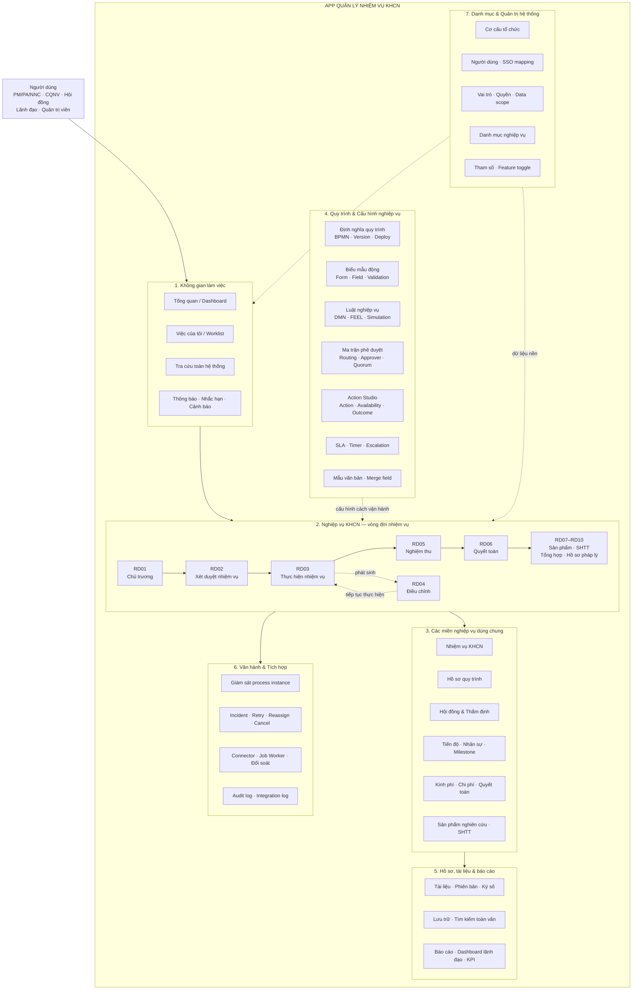
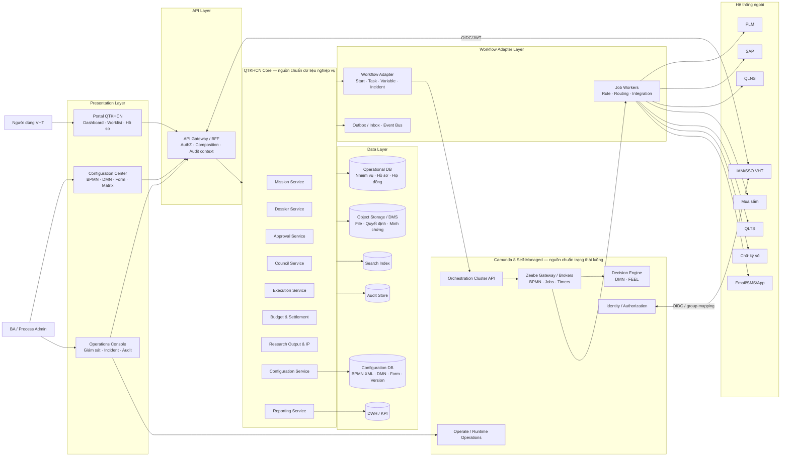
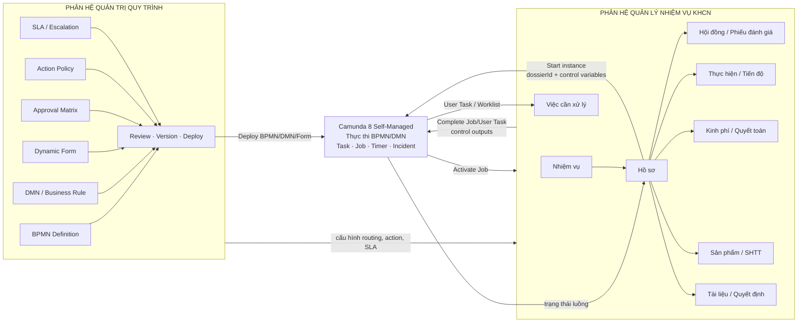

# Sơ đồ tổng quan App và các phân hệ QTKHCN

> Mục tiêu: cung cấp bản đồ cấp cao để BA, Dev và Kiến trúc sư thống nhất phạm vi toàn hệ thống. Các khối nét liền là năng lực của App QTKHCN; Camunda 8 là nền tảng điều phối độc lập, không thay thế dữ liệu và logic nghiệp vụ của App.

## 1. Bản đồ phân hệ chức năng

## 2. Kiến trúc logic toàn App

## 3. Quan hệ giữa hai phân hệ trọng tâm

## 4. Ranh giới trách nhiệm

| Khối | Chịu trách nhiệm | Không nên chịu trách nhiệm |
|---|---|---|
| Quản lý Nhiệm vụ KHCN | Nhiệm vụ, hồ sơ, hội đồng, kinh phí, sản phẩm, tài liệu | Điều khiển token BPMN trực tiếp |
| Quản trị Quy trình | BPMN/DMN/Form, version, approval matrix, action, SLA | Lưu nội dung hồ sơ nghiệp vụ |
| Camunda 8 | Token luồng, user task, job, timer, gateway, incident | Là database nhiệm vụ/hồ sơ/file |
| Workflow Adapter | Cô lập API/SDK Camunda, mapping instance/task/variable | Chứa toàn bộ business logic |
| Job Worker | Thực thi service task, gọi domain/external API, retry | Cho frontend gọi trực tiếp |
| BFF/API Gateway | Xác thực, phân quyền, compose dữ liệu cho UI | Để frontend gọi thẳng Camunda |

## 5. Trạng thái triển khai theo repo hiện tại

- Đã có route/UI nền: Tổng quan, Việc của tôi, Quy trình, Biểu mẫu, Nhiệm vụ, Hồ sơ, Cơ cấu tổ chức, Người dùng, Phân quyền, Giám sát, Tích hợp, Nhật ký, Luật nghiệp vụ, Ma trận phê duyệt và Cấu hình hành động.
- Cần hoàn thiện theo vòng đời nghiệp vụ: Chủ trương/xét duyệt, Hội đồng/thẩm định, Thực hiện, Điều chỉnh, Nghiệm thu, Quyết toán, Sản phẩm nghiên cứu, Báo cáo, Hồ sơ pháp lý và Danh mục nghiệp vụ.
- Camunda 8 Self-Managed là nền tảng độc lập; App kết nối qua Workflow Adapter và Job Worker.

