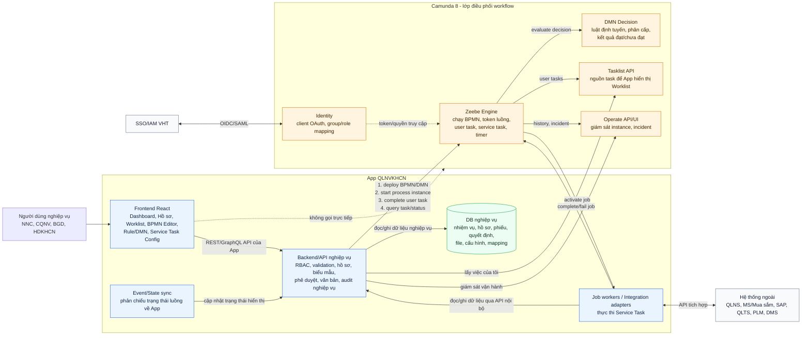
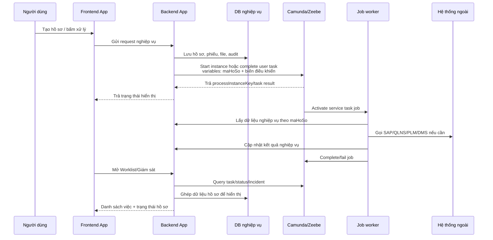

# Sơ đồ vai trò của Camunda với App QLNVKHCN

> Mục tiêu: làm rõ Camunda nằm ở đâu trong hệ thống đang code, phần nào App chịu trách nhiệm, phần nào Camunda chịu trách nhiệm.

## Cách đọc nhanh

Camunda không thay thế App. Camunda là lớp điều phối: biết hồ sơ đang ở bước nào, ai/nhóm nào cần xử lý, nhánh nào được chọn, deadline/timer nào đang chạy, service task nào cần kích hoạt.

App QLNVKHCN vẫn là nơi giữ dữ liệu nghiệp vụ: hồ sơ, nhiệm vụ, phiếu nhận xét, dự toán, quyết định, file, chữ ký, cấu hình hiển thị nút, audit nghiệp vụ.

Frontend chỉ gọi Backend/API của App. Frontend không gọi thẳng Camunda để tránh lộ credential, lệch RBAC, và khó kiểm soát audit.

Backend/API là cửa nối với Camunda: deploy BPMN/DMN, tạo process instance khi mở hồ sơ, complete task khi người dùng bấm duyệt/trả lại/từ chối, query Tasklist/Operate để hiển thị Worklist và giám sát.

Job worker là code của App nhận việc từ Camunda. Khi BPMN tới Service Task, Zeebe tạo job; worker poll job, gọi SAP/QLNS/PLM hoặc chạy logic nội bộ, rồi báo complete/fail về Camunda.

## Ranh giới trách nhiệm

| Việc cần làm                                       | Đặt ở App                                  | Đặt ở Camunda             |
| -------------------------------------------------- | ------------------------------------------ | ------------------------- |
| Nội dung hồ sơ, phiếu, file, quyết định            | Có                                         | Không                     |
| Validation nghiệp vụ phức tạp, truy vấn nhiều bảng | Có                                         | Không                     |
| Trình tự các bước xử lý                            | Không                                      | Có, bằng BPMN             |
| Gán task theo vai trò/candidate group              | App quản role, Camunda giữ task assignment | Có                        |
| Điều kiện rẽ nhánh đơn giản                        | Có thể chuẩn bị biến đầu vào               | Có, bằng gateway/DMN      |
| Service task tích hợp SAP/QLNS/PLM                 | Code worker thực thi                       | Camunda kích hoạt job     |
| Worklist người dùng                                | App hiển thị UI cấu hình                   | Camunda là nguồn task     |
| Giám sát incident/instance                         | App có màn hình tổng hợp                   | Operate là nguồn vận hành |

## Luồng ví dụ: tạo và xử lý một hồ sơ

## Nguyên tắc quan trọng

Camunda variables chỉ nên giữ `maHoSo` và các biến điều khiển rẽ nhánh như `cap`, `ketQuaThamDinh`, `ketQuaPheDuyet`, `quorumDat`. Không đưa nội dung hồ sơ, file, dự toán chi tiết hay phiếu nhận xét vào Camunda variables.
