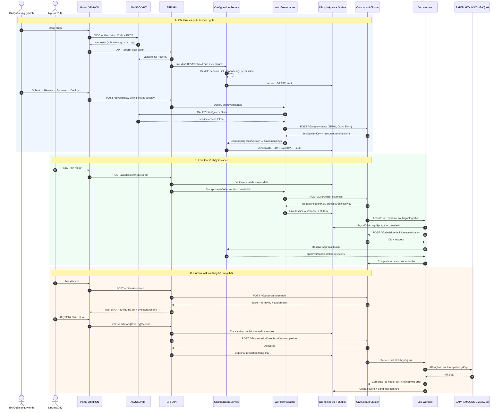
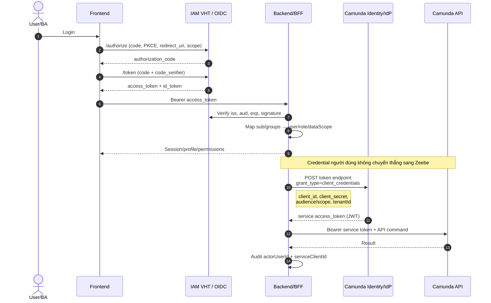
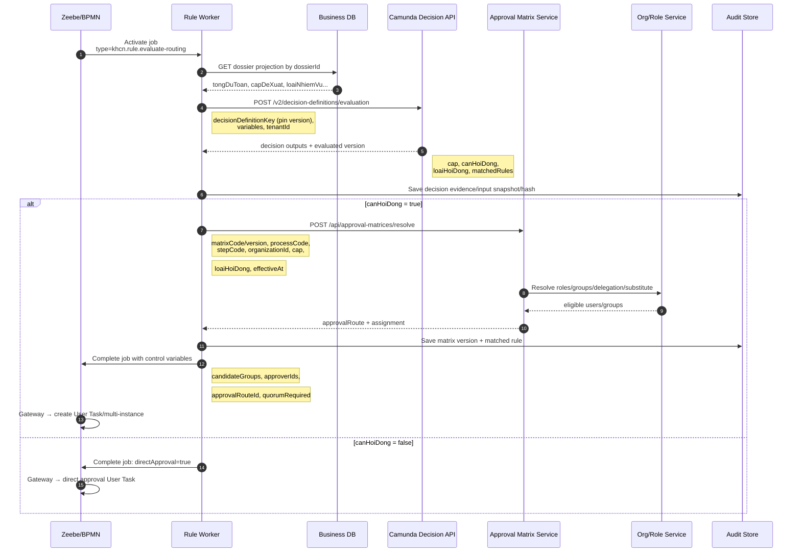
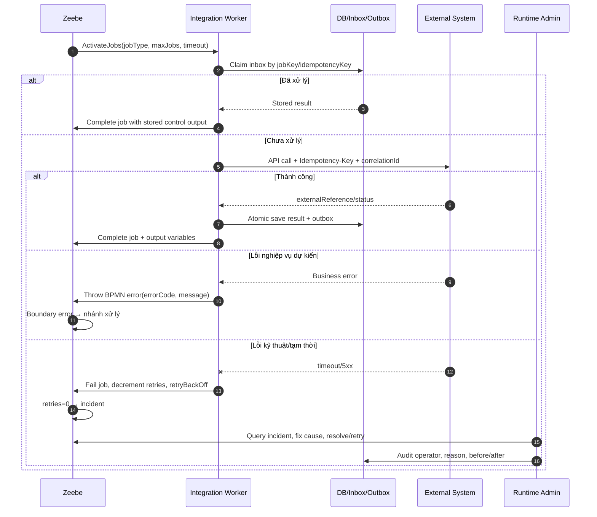

# Sequence tổng quan Quản trị quy trình ↔ Camunda 8

> Phạm vi: vòng đời đầy đủ từ xác thực, thiết kế/kiểm duyệt/deploy BPMN-DMN-Form, khởi tạo instance, đánh giá quyết định, phân giải ma trận phê duyệt, hoàn thành User Task, cập nhật trạng thái đối tượng nghiệp vụ, tích hợp và xử lý sự cố.
>
> Quy ước: `/api/...` là API nội bộ đề xuất của QTKHCN; `/v2/...` là Orchestration Cluster REST API của Camunda 8. Với Self-Managed, base URL/port và một số capability phụ thuộc phiên bản triển khai. Backend có thể dùng Camunda SDK/gRPC tương đương REST.

## 1. Toàn cảnh vòng đời



## 2. Xác thực: người dùng và service-to-service



**Field bắt buộc nên truyền xuyên suốt:** `sub/userId`, `roles`, `groups`, `organizationId`, `dataScopes`, `tenantId`, `correlationId`, `clientId`; secret chỉ nằm trong secret store, không log và không trả về frontend.

## 3. Thiết kế, version, kiểm duyệt và deploy

```mermaid
sequenceDiagram
    autonumber
    actor BA as BA
    actor RV as Reviewer/Approver
    participant FE as Process Designer UI
    participant CFG as Configuration Service
    participant VAL as Validator
    participant DB as Config DB
    participant WFA as Workflow Adapter
    participant C8 as Camunda /v2

    BA->>FE: Tạo/sửa workflow bundle
    FE->>CFG: PUT /api/workflow-definitions/{id}/draft
    Note right of FE: processCode, name, localVersion,<br/>bpmnXml, dmnRefs, formRefs,
    Note right of FE: versionTag, changeNote
    CFG->>VAL: Parse + lint BPMN/DMN/Form
    VAL->>VAL: Check IDs, FEEL, jobType, formKey,<br/>candidateGroups, variable contract
    VAL-->>CFG: errors/warnings/hash/dependencies
    CFG->>DB: Save immutable draft revision + checksum
    CFG-->>FE: validation report

    BA->>CFG: POST .../{versionId}/submit-review
    CFG->>DB: status=IN_REVIEW + audit
    RV->>CFG: POST .../{versionId}/approve
    CFG->>DB: status=APPROVED, approvedBy/At
    RV->>CFG: POST .../{versionId}/deploy
    CFG->>WFA: Deploy bundle + tenantId
    WFA->>C8: POST /v2/deployments<br/>multipart resources[]
    C8->>C8: Atomic deploy, assign versions/keys
    C8-->>WFA: deploymentKey + deployments[]
    WFA-->>CFG: processDefinitionKey/version,<br/>decisionDefinitionKey/version, formKey
    CFG->>DB: status=DEPLOYED; deployedAt; mapping
    CFG-->>RV: Deployment result

    Note over CFG,C8: Không sửa bản đã deploy. Thay đổi tạo version mới;
    Note over CFG,C8: instance đang chạy pin version cũ, bản mới chỉ áp dụng instance mới.
```

**Contract deploy nội bộ đề xuất**

```json
{
  "workflowDefinitionId": "wf-rd02-01",
  "processCode": "RD02.01",
  "versionTag": "2026.07.1",
  "tenantId": "<default>",
  "resources": ["RD02_01.bpmn", "rd02-routing.dmn", "phieu-phe-duyet.form"],
  "checksum": "sha256:...",
  "changeNote": "Cập nhật tuyến hội đồng",
  "correlationId": "..."
}
```

Camunda deploy: `POST /v2/deployments`, `multipart/form-data`, field chính `resources[]`, tùy chọn `tenantId`; response cần lưu `deploymentKey`, các `processDefinitionKey/processDefinitionId/version`, `decisionDefinitionKey/decisionDefinitionId/version`, `formKey`.

## 4. Khởi tạo process và quản lý trạng thái đối tượng

```mermaid
sequenceDiagram
    autonumber
    actor U as Người lập hồ sơ
    participant FE as Frontend
    participant DOS as Dossier Service
    participant DB as Business DB
    participant OUT as Outbox Publisher
    participant WFA as Workflow Adapter
    participant C8 as Camunda
    participant PROJ as Status Projector

    U->>FE: Bấm Trình hồ sơ
    FE->>DOS: POST /api/dossiers/{dossierId}/submit<br/>Idempotency-Key + If-Match
    DOS->>DB: Lock/check version + validate business rules
    DOS->>DB: state=SUBMITTING; append audit/outbox
    DOS->>WFA: Start process command
    WFA->>C8: POST /v2/process-instances
    Note right of WFA: processDefinitionId or Key,<br/>version (không latest ở production),
    Note right of WFA: variables, tenantId,
    Note right of WFA: operationReference/tags
    C8-->>WFA: processInstanceKey + processDefinitionKey
    WFA->>DB: workflowLink + state=SUBMITTED
    DOS-->>FE: 202/200 + dossierVersion + workflow status

    C8->>PROJ: Exporter/event hoặc worker callback
    PROJ->>DB: Upsert workflow projection
    OUT->>PROJ: Retry nếu event chưa xử lý
    PROJ->>PROJ: Deduplicate(eventId), enforce ordering
    Note over DB,PROJ: DB nghiệp vụ là source of truth nội dung;
    Note over DB,PROJ: Camunda là source of truth token/trạng thái luồng.
```

**Variables tối thiểu khi start**

```json
{
  "dossierId": "HS-2026-050",
  "missionId": "NV-2026-012",
  "businessKey": "HS-2026-050",
  "processCode": "RD02.01",
  "initiatorUserId": "u123",
  "organizationId": "TT-01",
  "cap": "CS",
  "schemaVersion": 1,
  "correlationId": "..."
}
```

Không đưa vào variables: file, toàn bộ hồ sơ, dự toán chi tiết, phiếu nhận xét hoặc dữ liệu nhạy cảm lớn. Camunda 8 dùng custom variable `businessKey` nếu dự án cần khái niệm này; khóa kỹ thuật chính vẫn là `processInstanceKey`.

## 5. DMN → Gateway → Ma trận phê duyệt → User Task



**Ranh giới bắt buộc:**

- DMN trả lời điều kiện/kết quả: `cap`, `canHoiDong`, `loaiHoiDong`.
- Approval Matrix trả lời ai xử lý và theo chuỗi nào: `approverIds`, `candidateGroups`, `steps`, `quorumRequired`.
- BPMN quyết định thứ tự thực thi và chờ task/timer nào.

DMN API chính thức: `POST /v2/decision-definitions/evaluation`. Nên dùng `decisionDefinitionKey` để pin đúng version; dùng `decisionDefinitionId` sẽ lấy bản mới nhất. Field đầu vào chính: `decisionDefinitionKey` hoặc `decisionDefinitionId`, `variables`, `tenantId`.

## 6. Worklist, available-actions và hoàn thành User Task

```mermaid
sequenceDiagram
    autonumber
    actor U as Approver
    participant FE as Custom Task UI
    participant BFF as BFF
    participant C8 as Camunda User Task API
    participant DOS as Dossier Service
    participant POL as Action/Permission Policy
    participant DB as Business DB

    U->>FE: Mở Việc của tôi
    FE->>BFF: POST /api/tasks/search
    BFF->>C8: POST /v2/user-tasks/search
    Note right of BFF: assignee/candidateGroups,<br/>state, processInstanceKey,<br/>page/sort
    C8-->>BFF: userTaskKey, elementId, formKey,<br/>candidateGroups, dueDate, state
    BFF->>DOS: Load dossier summary by dossierId
    BFF->>POL: GET /api/dossiers/{id}/available-actions
    POL-->>BFF: actionCode, enabled, reason requirements
    BFF-->>FE: Composed task view

    U->>FE: Chọn APPROVE/RETURN/REJECT
    FE->>BFF: POST /api/tasks/{userTaskKey}/actions
    Note right of FE: actionCode, expectedTaskState,<br/>dossierVersion, reason, formData,
    Note right of FE: evidenceIds, idempotencyKey
    BFF->>POL: Authorize role + dataScope + policy
    POL-->>BFF: Allowed + outcome
    BFF->>DB: Save decision/form/audit/outbox
    BFF->>C8: POST /v2/user-tasks/{userTaskKey}/completion
    Note right of BFF: variables: outcome, reasonCode,<br/>decisionId; action idempotency at app
    C8-->>BFF: Success / conflict if no longer active
    BFF->>DB: state projection + task completed marker
    BFF-->>FE: New state + next actions
```

Lưu ý: User Task phải dùng API completion của User Task. `CompleteJob` chỉ dành cho job/service task (hoặc mô hình user task kiểu job-worker cũ), không dùng lẫn trong contract mới.

## 7. Service task, retry, incident và đối soát



Field vận hành chính: `jobKey`, `jobType`, `processInstanceKey`, `elementInstanceKey`, `retries`, `retryBackOff`, `timeout`, `errorCode`, `errorMessage`, `incidentKey`, `externalReference`, `idempotencyKey`, `correlationId`.

## 8. Danh mục API tối thiểu

| Nghiệp vụ | API QTKHCN đề xuất | Camunda API/command | Field quan trọng |
|---|---|---|---|
| Lưu draft | `PUT /api/workflow-definitions/{id}/draft` | Chưa gọi Camunda | `processCode`, XML/JSON, `localVersion`, `checksum`, `changeNote` |
| Validate | `POST /api/workflow-definitions/{id}/validate` | Có thể validate local/SDK | IDs, FEEL, `jobType`, `formKey`, variables, dependencies |
| Deploy bundle | `POST /api/workflow-definitions/{id}/deploy` | `POST /v2/deployments` hoặc `DeployResource` gRPC | `resources[]`, `tenantId`, resource keys/versions |
| Start instance | `POST /api/dossiers/{id}/submit` | `POST /v2/process-instances` hoặc `CreateProcessInstance` | definition id/key, version, variables, tenant, tags |
| Evaluate DMN | Worker/internal rule endpoint | `POST /v2/decision-definitions/evaluation` hoặc `EvaluateDecision` | decision id/key, input variables, tenant |
| Resolve approver | `POST /api/approval-matrices/resolve` | Không phải API Camunda | matrix/version, step, org, effective time, decision outputs |
| Search task | `POST /api/tasks/search` | `POST /v2/user-tasks/search` | assignee/groups, state, instance, pagination |
| Available actions | `GET /api/dossiers/{id}/available-actions` | Kết hợp active task/query | action, enabled, permission, reason/evidence flags |
| Complete user task | `POST /api/tasks/{key}/actions` | `POST /v2/user-tasks/{key}/completion` | outcome variables, expected state, idempotency |
| Worker execution | Không expose cho FE | Activate/Complete/Fail job gRPC/SDK | job key/type, variables, retries, timeout |
| Monitor/reconcile | `GET /api/workflow-instances/{key}` | Orchestration Cluster search APIs/Operate | instance key, state, incident, active elements |
| Cancel instance | `POST /api/workflow-instances/{key}/cancel` | Cancel process instance | reason, operator, expected state |

## 9. Quy tắc consistency và audit

1. Không có distributed transaction giữa DB nghiệp vụ và Camunda; dùng local transaction + Outbox/Inbox + idempotency + reconciliation job.
2. Mọi command có `correlationId`; command do người dùng kích hoạt có thêm `actorUserId`, `actionCode`, `reason` và `expectedVersion`.
3. Lưu mapping: `dossierId`, `missionId`, `processCode`, `processDefinitionKey`, `processInstanceKey`, `tenantId`, `startedAt`, `endedAt`, `state`.
4. Lưu bằng chứng quyết định: decision/matrix code và version/key, input snapshot hoặc hash, output, matched rule, thời điểm, người/chương trình gọi.
5. Pin version BPMN/DMN/Approval Matrix trong production; không dùng `latest` nếu cần tái lập và kiểm toán.
6. Trạng thái UI là projection; phải có job đối soát DB ↔ Camunda để sửa các ca timeout kiểu “Camunda đã nhận nhưng app chưa ghi nhận”.

