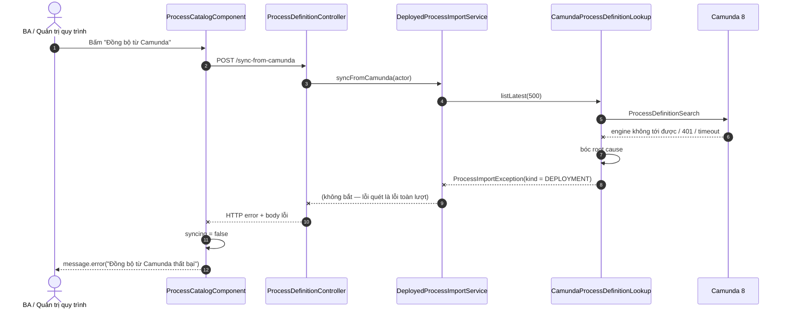

# Sequence — Đồng bộ quy trình từ Camunda

> Phạm vi: nút **"Đồng bộ từ Camunda"** ở màn `/quy-trinh` (Danh mục quy trình) — hút các process
> definition được deploy **thẳng lên Camunda** (Web Modeler, `zbctl`, CI) về catalog của app, để chúng
> chọn được khi gửi duyệt và dựng được bước trong `DeployedBpmnRoutingReader`.
>
> Nguồn code: `process-catalog.ts:206`, `process-definition.service.ts:38`,
> `ProcessDefinitionController.syncFromCamunda`, `DeployedProcessImportService`,
> `CamundaProcessDefinitionLookup`, `DeployedProcessImportWriter`, `DeployedProcessPolicyScaffolder`.

## 1. Luồng chính

```mermaid
sequenceDiagram
    autonumber
    actor BA as BA / Quản trị quy trình
    participant FE as ProcessCatalogComponent<br/>(/quy-trinh)
    participant SVC as ProcessDefinitionService<br/>(Angular HTTP)
    participant API as ProcessDefinitionController
    participant IMP as DeployedProcessImportService
    participant LKP as CamundaProcessDefinitionLookup
    participant C8 as Camunda 8<br/>(Orchestration Cluster)
    participant WR as DeployedProcessImportWriter<br/>(REQUIRES_NEW)
    participant DB as DB catalog<br/>(catalog + version)
    participant SCF as DeployedProcessPolicyScaffolder<br/>(AFTER_COMMIT)

    rect rgb(239,246,255)
        Note over BA,API: A. Kích hoạt — chủ động bấm nút, KHÔNG chạy nền
        BA->>FE: Bấm "Đồng bộ từ Camunda"
        FE->>FE: syncing = true; xoá syncResult cũ
        FE->>SVC: syncFromCamunda(auth.user().hoTen)
        SVC->>API: POST /api/process-definitions/sync-from-camunda<br/>header X-QTKHCN-Actor
        API->>IMP: syncFromCamunda(actor)
    end

    rect rgb(240,253,244)
        Note over IMP,C8: B. Quét engine (một lượt, trần MAX_SCAN = 500)
        IMP->>LKP: listLatest(500)
        LKP->>C8: ProcessDefinitionSearch<br/>filter isLatestVersion(true), page.limit(500)
        C8-->>LKP: items[] + page.totalItems
        LKP-->>IMP: DeployedProcessPage(items, totalOnEngine)
        alt totalOnEngine > items.size()
            IMP->>IMP: warnings += "Engine có N quy trình,<br/>lượt này chỉ quét M — chạy lại"
        end
    end

    rect rgb(254,249,231)
        Note over IMP,SCF: C. Với TỪNG definition — hút được cái nào chắc cái đó
        loop mỗi DeployedProcessDefinition
            IMP->>DB: findByCamundaProcessDefinitionKey(key)
            alt Catalog đã biết key này
                DB-->>IMP: có bản ghi
                IMP->>IMP: alreadyKnown++ → bỏ qua
            else Chưa biết
                DB-->>IMP: rỗng
                IMP->>LKP: fetchXml(processDefinitionKey)
                LKP->>C8: GetProcessDefinitionXml
                C8-->>LKP: BPMN XML
                LKP-->>IMP: bpmnXml

                IMP->>WR: write(definition, bpmnXml, actor)
                activate WR
                Note right of WR: Transaction RIÊNG (REQUIRES_NEW):<br/>một bản lỗi không rollback<br/>những bản đã nhập trước
                WR->>DB: findByBpmnProcessId(bpmnProcessId)
                alt Đã có catalog (deploy qua app trước đó)
                    WR->>DB: UPDATE catalog (name, updatedAt)
                else Chưa có
                    WR->>DB: INSERT catalog mới (newCatalog = true)
                end
                WR->>DB: INSERT process_definition_version<br/>status=DEPLOYED, source=EXTERNAL,<br/>checksumSha256, deploymentKey=0, bpmnXml
                WR->>WR: publishEvent(ProcessDeployedEvent)
                deactivate WR
                WR-->>IMP: ImportedProcess(catalogId, versionId, ...)

                Note over WR,SCF: commit transaction ⇒ AFTER_COMMIT
                WR-->>SCF: ProcessDeployedEvent(bpmnProcessId, actor)
                SCF->>SCF: actionStudio.scaffold(...)<br/>sinh luật hiển thị nút
                Note right of SCF: Lỗi scaffold chỉ log warning —<br/>KHÔNG vào response, KHÔNG làm hỏng lượt nhập

                opt write ném RuntimeException
                    IMP->>IMP: failures += SyncFailure(bpmnProcessId, rootMessage)
                end
            end
        end
    end

    rect rgb(245,243,255)
        Note over IMP,BA: D. Trả kết quả tổng hợp
        IMP-->>API: ProcessSyncResponse(scanned, imported, alreadyKnown,<br/>importedProcesses[], failures[], warnings[])
        API-->>SVC: 200 OK
        SVC-->>FE: ProcessSyncResponse
        FE->>FE: syncing = false; syncResult = result
        alt imported > 0
            FE->>FE: activeTabIndex = 1 (tab "Đã deploy")
            FE->>API: reload() → GET /api/process-definitions
            API-->>FE: danh sách catalog đã cập nhật
        end
        FE-->>BA: Banner tóm tắt: đã quét / nhập mới / đã biết / lỗi / cảnh báo
    end
```

## 2. Luồng lỗi (toàn lượt hỏng)



## 3. Quyết định thiết kế đã chốt (đọc kèm diagram)

| Quyết định | Lý do |
|---|---|
| **Chủ động (bấm nút), không chạy nền** | Đồng bộ ngầm mỗi lần khởi động sẽ âm thầm kéo cả process rác trên engine dev vào danh sách người dùng chọn khi gửi duyệt. |
| **Khoá đối chiếu = `camundaProcessDefinitionKey`**, không phải `bpmnProcessId` | Quy trình do chính app deploy đã lưu key này ⇒ được nhận là "đã biết" thay vì nhập lại thành dòng version trùng. |
| **Chỉ lấy `isLatestVersion(true)`** | Runtime luôn khởi động bản mới nhất; kéo cả lịch sử chỉ làm phình `process_definition_version`. |
| **Trần `MAX_SCAN = 500` + `totalOnEngine`** | Engine lạ có hàng nghìn definition không kéo hết trong một request; vượt trần thì **warning**, không im lặng. |
| **`REQUIRES_NEW` mỗi bản ghi** | Một lỗi ghi (ví dụ đụng unique `(catalog_id, camunda_version)`) không được kéo đổ những quy trình đã nhập thành công trước đó. |
| **`failures[]` thay vì ném lỗi ở bản hỏng đầu tiên** | Một quy trình không đọc được XML không được chặn phần còn lại vào catalog. |
| **`camundaDeploymentKey = 0`** | Search API của Camunda không trả deployment key; cột này chỉ dùng truy vết ngược lên Operate, không tham gia khoá hay logic. |
| **KHÔNG lint/validate lúc nhập** | Theo quyết định 2026-07-28 ("chưa cần warning hoặc chặn cứng"); chẩn đoán thiếu form / sai vai trò thuộc màn **Đối soát**. |
| **Scaffold luật hành động AFTER_COMMIT** | Cùng transaction thì lỗi scaffold đánh dấu rollback-only làm mất dòng catalog; `REQUIRES_NEW` ngay tại chỗ thì không thấy dòng version chưa commit ⇒ scaffold thành no-op im lặng. |
| **`source = EXTERNAL`** | Phân biệt hai đường tạo BPMN đã chốt: deploy qua app vs. deploy thẳng lên Camunda. Cùng `bpmnProcessId` ⇒ **một** dòng catalog, khác dòng version. |
